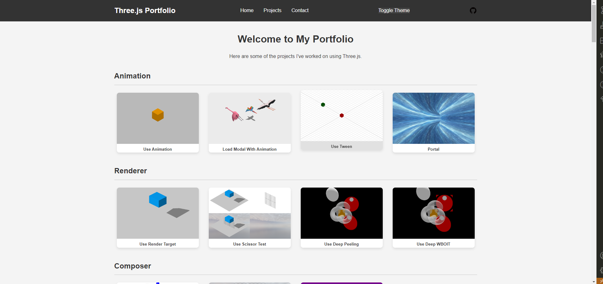

# Threejs-Demo



Preview Link: https://wuyifan0203.github.io/threejs-demo/

## Introduction

This is a case library that serves as a feasibility verification and learning tool, developed using Three.js and other dependencies. The library includes functionalities such as:

[x] Model import,

[x] Geometry transformations,

[x] Camera operations,

[x] Object selection,

[x] Shader application,

[x] Physics engine,

and more.
## Getting Started
```shell
# Install dependencies
pnpm install
# Preview the project
pnpm dev
```

## Adding New Cases

1. Add the case type, name, and path in `pageList.js`.
2. Add the case files in the corresponding directory.
3. Run `pnpm screenshot` to generate case screenshots.
4. Run `pnpm dev` to preview the effect.

## Contribution

If you have any suggestions or want to contribute code, feel free to submit a Pull Request or create an Issue.

## License

This project is licensed under the MIT License. Please refer to the `LICENSE` file for more information.
